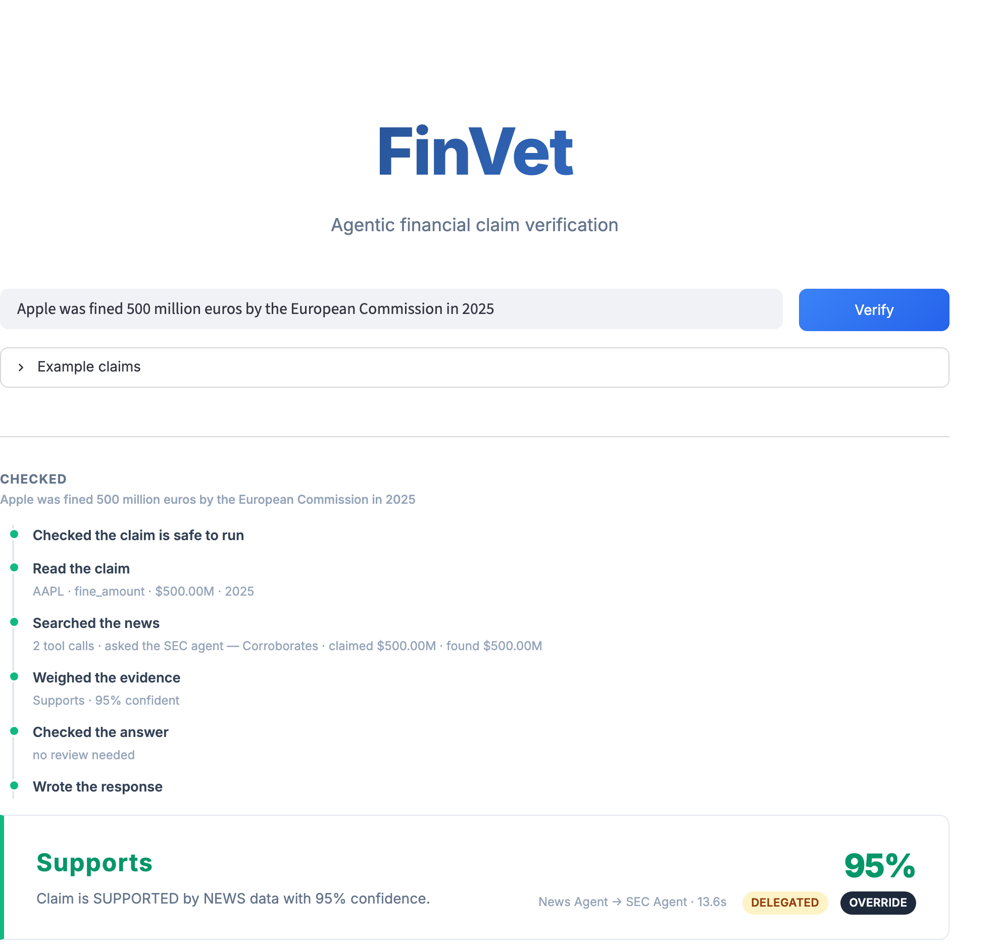
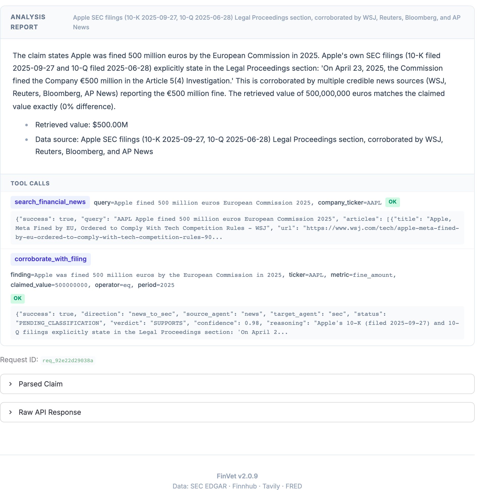

# FinVet

**Agentic financial claim verification.**

[](https://github.com/danielberhane/finvet/actions/workflows/ci.yml)
[](LICENSE)


FinVet verifies one financial claim at a time. Given *"Microsoft's fiscal 2025 revenue was
$282 billion,"* it returns a verdict of supported, refuted, or not enough information, a
confidence score, and the number it compared the claim against. Each response also names the
agent that answered, lists every tool call it made in order, and keeps an audit trail of the
run.

<p align="center">
  <a href="docs/diagrams/finvet-delegation-run.png"></a>
  <br><sub>A news claim the news agent cannot settle alone. It searched, then handed the finding to
  the SEC agent, which found the same &euro;500 million in Apple's filing. Click any image for full
  resolution.</sub>
</p>

<p align="center">
  <a href="docs/diagrams/finvet-delegation-evidence.png"></a>
  <br><sub>The same run's evidence: every tool call with its arguments and raw response, including the
  delegation itself and what the SEC agent sent back.</sub>
</p>

> **Not financial advice.** A research and demonstration system; outputs may be wrong and must
> be independently verified. Not affiliated with any data provider named here.

---

## Deterministic verdict override

Models are unreliable at comparing numbers, and that comparison decides the verdict. FinVet
recomputes it in Python, with tolerances that depend on the source. Python's result stands
when the two disagree, and both verdicts are kept in the response.

The comparison uses only a structured value returned by a tool. A claim with no such value
returns not enough information.

---

## Evaluation

**Claim set.** 97 financial claims, held out and frozen, covering filing lookups, market
quotes, News→SEC delegation, guardrail blocks, and claims the parser must refuse. Composition,
labelling rules and disclosed biases are in the [dataset card](docs/eval/DATASET_CARD.md).

**Protocol.** Two models, one run each on identical code; one of them repeated four times to
measure stability. Retrieval is measured separately, on its own cases. Each run is scored on
seven layers:

1. **Outcome**: the verdict.
2. **Tool trajectory**: the tools called.
3. **Grounding**: every decisive number traced to a source.
4. **Calibration**: stated confidence against observed accuracy.
5. **Asymmetric risk**: the cost of the errors made.
6. **Reliability**: agreement across repeated runs.
7. **Reachability**: evidence arriving by the expected path.

### Cross-model benchmark

| Layer | `deepseek-chat` | `MiniMax-M2.7` |
|---|---|---|
| 1. Outcome, verdict accuracy (86 claims, excluding 8 live-market and 3 observe-only) | **96.5%** | **96.5%** |
| 2. Tool trajectory, required tools called (DeepEval) | 98.4% | 94.8% |
| 3. Grounding, decisive numbers traced to a source (42) | **100%** | **100%** |
| 4. Calibration, decisive-verdict ECE | 0.039 | 0.046 |
| 5. Asymmetric risk, confidently-wrong verdicts (of 94 scored) | **0** | **0** |
| 5. Asymmetric risk, declined rather than answered | 3.2% | 7.4% |
| 7. Reachability, evidence path matches expectation | 97.9% | 96.8% |

Layer 6, reliability, needs repeated runs, so it is reported below rather than per model.

Three of those results are properties of the code rather than of a run: an agent cannot call
another agent's tools, the 32 claims that must spend nothing never reach one,
and a decisive numeric verdict is unreachable without a trusted observation.

**Stability.** Four runs on one model: pass@1 98.9%, **pass^4 94.5%**. Every row that missed
pass^4 had escalated to human review on at least one attempt; none returned a wrong verdict.

**Retrieval.** XBRL lookups against SEC primary-source values: **198/199**, the one miss
returning not enough information rather than a wrong number. Filing-text retrieval on the
70-case set that also set the relevance threshold: 30 of 30 on-topic retrieved, 30 of 30
off-topic rejected, 10 near-misses returned nothing. Both gold sets are held privately, so
unlike the table above these are not recomputable from this repository.

**Evidence.** [`docs/eval/`](docs/eval/) holds the redacted per-claim artifacts, the layer
summaries, the [benchmark write-up](docs/eval/BENCHMARK_2026-08-31.md) and the
[dataset card](docs/eval/DATASET_CARD.md). Every figure in the table recomputes from them.
The claim set itself is held out, and available to reviewers against its published hash.
It was written by the author of the system; 57 of its parse labels have not been
adjudicated by a second reader, and no independent validation has been performed.

---

## Architecture

A 12-node LangGraph `StateGraph`. Three domain agents route by claim type, each a ReAct loop
with its own tools: routing, period resolution, consensus and guardrails are fixed pipeline
stages, and within the selected agent the model chooses its own tool calls. One agent runs
per claim, so consensus passes its verdict through and adjusts confidence rather than
reconciling several opinions.

<p align="center">
  <a href="docs/diagrams/finvet-linkedin.png"></a>
  <br><sub>Click the diagram for full resolution.</sub>
</p>

| Agent | Handles | Sources | Can delegate to |
|---|---|---|---|
| **SEC** | GAAP financials, and claims about what a filing says | SEC EDGAR (XBRL) via MCP, hybrid RAG over filing text | — |
| **Market** | Prices, valuation, market cap | Finnhub | — |
| **News** | Events and announcements | Tavily search | SEC |

**Delegation** runs one way: News asks SEC whether the issuer's own filing discloses a
reported fine or settlement. One hop, in-process, no wire protocol. The SEC agent holds no
delegation tool, so the call cannot recurse. Where the filing states an amount, the verdict follows the filing rather than the
press.

**Trust boundary.** XBRL is the authoritative numeric source. Retrieved filing text is
supporting evidence, and a model's reading of it never becomes the number a verdict rests on;
absence of a passage is never treated as refutation. The one exception is fines and
settlements, which have no XBRL concept: Python extracts the amount from Legal Proceedings
text, and only when exactly one unambiguous candidate is present.

**Guardrails and review.** Regex and PII checks always run, with an optional Llama Guard layer
on input and output. The guards decide safety; the parser decides whether a claim is
verifiable. Review triggers on low confidence, unsafe output, or a press-versus-filing
conflict, pausing at a LangGraph checkpoint and resuming with the reviewer's decision merged
in. Every tool call and verdict is persisted with a checksum the API re-verifies on read; see
[SECURITY.md](SECURITY.md) for what that does and does not guarantee.

Mechanics — retrieval fusion, delegation states, review recovery:
[`docs/ARCHITECTURE.md`](docs/ARCHITECTURE.md) ·
[`docs/RAG_AND_AGENTIC_RAG_GUIDE.md`](docs/RAG_AND_AGENTIC_RAG_GUIDE.md).

---

## Quickstart

```bash
git clone https://github.com/danielberhane/finvet.git && cd finvet
cp .env.example .env            # add DEEPSEEK_API_KEY, TAVILY_API_KEY, POSTGRES_PASSWORD
docker compose --profile sec up --build
docker exec finvet-ollama ollama pull nomic-embed-text   # embeddings, one-time
# UI → http://localhost:8501   API → http://localhost:8000
```

Prebuilt images are published on tagged releases: `docker pull ghcr.io/danielberhane/finvet-api:latest`
(and `finvet-ui`). Every port binds to `127.0.0.1`; read [SECURITY.md](SECURITY.md) before
exposing the stack. Real API keys are required, since the system verifies against live data.
Missing optional keys disable their feature rather than crashing.

<details>
<summary><b>Native dev · RAG ingest · compose profiles · which key powers what</b></summary>

### Native (hot reload)

```bash
uv sync
cp .env.example .env
docker compose up -d postgres                        # pgvector
uvicorn finvet.main:app --port 8000 --app-dir src    # API → :8000
streamlit run ui/app.py --server.port 8501           # UI  → :8501
```

### Populating the RAG index

The vector store starts empty — filings are not distributed with the repo. XBRL verification
works without it; RAG over filing text needs an ingest pass:

```bash
# Place filings as data/filings/<TICKER>/<TICKER>_<FORM>_<PERIOD-END>.html
python -m finvet.rag.ingest                    # defaults to data/filings
```

Requires Postgres and Ollama with `nomic-embed-text` pulled (~270 MB, no API key — embedding
is local). The optional Llama Guard layer needs `ENABLE_LLAMA_GUARD=true` and
`llama-guard3:8b` (~5 GB).

### Profiles

| Profile | Adds | For |
|---|---|---|
| *(default)* | Postgres + pgvector, Ollama, API, UI | always |
| `--profile sec` | SEC EDGAR MCP (self-contained, from PyPI) | SEC claims (most demos) |

### Keys

| Key | Powers | Without it |
|---|---|---|
| `DEEPSEEK_API_KEY` | claim parsing, agents, verdicts | the default provider fails to start; point the roles elsewhere and it is not needed |
| `TAVILY_API_KEY` | news search | **required** — nothing runs |
| `FINNHUB_API_KEY` | market quotes, tickers | market claims → NOT_ENOUGH_INFO |
| *(none)* | embeddings, SEC XBRL | local Ollama / free public endpoints |

The LLM is pluggable ([`llm/factory.py`](src/finvet/llm/factory.py)): point any
OpenAI-compatible chat-completions endpoint — Ollama, vLLM, LiteLLM, or a hosted vendor — at
any of the three roles via env vars, no code change.

### Tracing (LangSmith)

Off by default. Set `LANGCHAIN_TRACING_V2=true`, `LANGCHAIN_API_KEY`, and `LANGCHAIN_PROJECT`
in `.env` and restart the API. Every verification then appears as one trace named
`finvet-verify` (`finvet-verify-stream`, `finvet-review-resume`, `finvet-review-reconcile`
for the other entry points) carrying the `request_id` in its metadata, so a trace joins to
its audit row at `GET /audit/{request_id}`. A trace holds every graph node, model call, and
tool call with latency and token counts. The same total is on every response as
`metadata.total_tokens_used`, delegated runs included, so cost per claim needs no tracing.

What three sample traces showed on the default provider: an SEC claim is ~20 s and ~20.8k
tokens across six model calls (~7 s in total); the XBRL fetch behind `get_income_statement`
was 11–15 s of that, so latency is dominated by the data source, not the model. A news claim
that delegated to the SEC agent was ~21 s and ~38.9k tokens. Prompt tokens are ~96% of the
total — the ReAct loop re-sends the growing context on each step.

**Tracing is data egress.** The claim text, tool outputs (filing excerpts, quotes, news
snippets), and model prompts leave the machine for LangSmith. Do not enable it on claims you
would not send to a third party.

</details>

---

## Limitations

Packaged for local and demo use. With SEC MCP or Ollama down, the API degrades to
NOT_ENOUGH_INFO or review rather than failing.

- **Scope**: US large-cap equities, point-in-time claims. Latency on the default provider,
  p50 13s and p95 23s per claim.
- **Numeric verdicts need a structured source**: an XBRL fact, a market quote field, or the
  deterministic fine/settlement extraction. The other 45 metrics the parser accepts, analyst
  price targets among them, are declined up front with a stated reason.
- **Not a compliance product.** It applies model-risk-management principles; it certifies
  nothing.
- **Not a service.** The API has no authentication, authorization, rate limiting or tenant
  isolation ([SECURITY.md](SECURITY.md)). Review checkpoints live in process memory, so a
  pending review does not survive an API restart. It is single-process and has not been
  load-, failover- or sustained-degradation-tested; the latency figures above are from
  benchmark runs, one claim at a time.

Narrower limits, and the reasoning behind each, are recorded in
[`docs/RELEASE_A_DECISIONS.md`](docs/RELEASE_A_DECISIONS.md).

---

## Contributing

Bug reports and focused fixes are welcome. [CONTRIBUTING.md](CONTRIBUTING.md) covers setup,
what CI enforces, and the changes that will be declined. For vulnerability reports, and for
what this system does and does not defend against, see [SECURITY.md](SECURITY.md).

## Citation

To cite this software, use [CITATION.cff](CITATION.cff).

**Prior work.** FinVet v1, joint work with Duoduo Liao, verified claims with two retrieval
pipelines and an external fact-check source, deciding verdicts by confidence-weighted vote
([IEEE BigData 2025](https://ieeexplore.ieee.org/document/11400848);
[code](https://github.com/danielberhane/finvet-v1)). This release replaces that design: one
agent per claim, and the verdict settled by a deterministic comparator rather than a vote.

## License

[Apache-2.0](LICENSE). FinVet runs third-party components without distributing them, notably
the AGPL-3.0 SEC EDGAR MCP server, which runs as its own container; see
[THIRD_PARTY_NOTICES.md](THIRD_PARTY_NOTICES.md). Users must honor each provider's terms,
including the [SEC Fair Access policy](https://www.sec.gov/os/webmaster-faq#developers).
