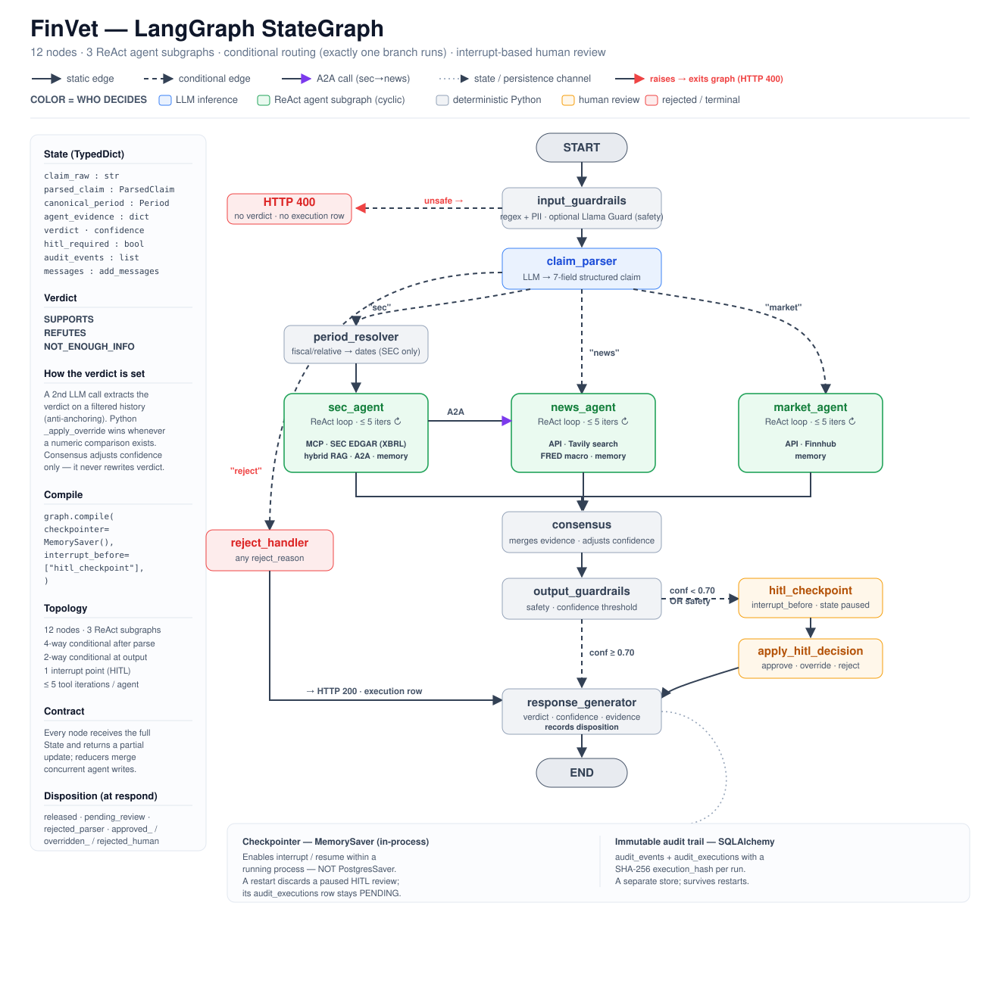

# FinVet

**An agentic AI system that verifies financial claims against authoritative sources — and records exactly how it decided.**

[](https://github.com/danielberhane/finvet/actions/workflows/ci.yml)
[](https://arxiv.org/abs/2510.11654)
[](LICENSE)


Give it a claim — *"Apple's fiscal 2024 revenue was $391 billion"* — and it returns a verdict
(`SUPPORTS` / `REFUTES` / `NOT_ENOUGH_INFO`), a confidence score, the evidence chain, and a
full audit trail of every step that produced the answer.

> **Not financial advice.** A research and demonstration system; outputs may be wrong and must
> be independently verified. Not affiliated with or endorsed by any data provider named here.

---

## The idea: the model doesn't get the last word

Verdict LLMs are unreliable at number comparison — ask a frontier model whether `0.98%` exceeds
`1%` and it will confidently say yes. In a domain where the task *is* comparing a claimed number
to a filed one, that's unacceptable. So when both the claimed and retrieved values exist, FinVet
recomputes the comparison **in Python**, with source-appropriate tolerances, and overrides the
model when they disagree. Both results are kept:

```python
{"verdict": "REFUTES", "llm_original_verdict": "SUPPORTS", "override_applied": True}
```

See [`_apply_override`](src/finvet/agents/base.py). This is also what makes a prompt injection
hard to weaponize: it can sway the model's prose, but not a numeric verdict.

---

## Architecture

A 12-node LangGraph `StateGraph`. Three domain agents fan out by claim type, each a ReAct loop
with its own tools; their evidence is reconciled, guarded, and — when confidence is low — paused
for human review.



```
input_guardrails → claim_parser → ┬─ period_resolver → sec_agent ─┐
                                  ├─ market_agent ────────────────┤
                                  ├─ news_agent ──────────────────┤→ consensus →
                                  └─ reject_handler ──────────────┘   output_guardrails →
                                                          (hitl_checkpoint) → response
```

| Agent | Handles | Sources |
|---|---|---|
| **SEC** | GAAP financials — revenue, income, EPS, balance sheet, cash flow | SEC EDGAR (XBRL) via MCP, hybrid RAG over filings |
| **Market** | Prices, valuation, market cap | Finnhub |
| **News** | Events, announcements, macro indicators | Tavily search, FRED |

Deeper dives: [`docs/ARCHITECTURE.md`](docs/ARCHITECTURE.md) · full StateGraph in
[`docs/diagrams/finvet_engineering.svg`](docs/diagrams/finvet_engineering.svg).

---

## Quickstart

The whole system — Postgres, API, UI, and the SEC MCP server — comes up with one command. No
sibling checkouts, no manual schema step (the API creates its schema on first boot).

```bash
git clone https://github.com/danielberhane/finvet.git && cd finvet
cp .env.example .env            # add DEEPSEEK_API_KEY, TAVILY_API_KEY, POSTGRES_PASSWORD
docker compose --profile sec up --build
# UI → http://localhost:8501   API → http://localhost:8000
```

Prefer not to build? `docker pull ghcr.io/danielberhane/finvet-api:latest` (and `finvet-ui`).

It talks to live financial data, so it needs real keys — the honest cost of not mocking the
hard part. Only `DEEPSEEK_API_KEY`, `TAVILY_API_KEY`, and `POSTGRES_PASSWORD` are required;
the system degrades by feature, never crashing when an optional key is absent.

<details>
<summary><b>Native dev · compose profiles · which key powers what</b></summary>

### Native (hot reload)

```bash
uv sync
cp .env.example .env
docker compose up -d postgres                        # pgvector
uvicorn finvet.main:app --port 8000 --app-dir src    # API → :8000
streamlit run ui/app.py --server.port 8501           # UI  → :8501
```

### Profiles

| Profile | Adds | For |
|---|---|---|
| *(default)* | Postgres + pgvector, API, UI | always |
| `--profile sec` | SEC EDGAR MCP (self-contained, from PyPI) | SEC claims (most demos) |
| `--profile guards` | Ollama | optional Llama Guard (~5 GB, opt-in) |

### Keys

| Key | Powers | Without it |
|---|---|---|
| `DEEPSEEK_API_KEY` | claim parsing, agents, verdicts | **required** — nothing runs |
| `TAVILY_API_KEY` | news search | news claims → NOT_ENOUGH_INFO |
| `FINNHUB_API_KEY` | market quotes, tickers | market claims → NOT_ENOUGH_INFO |
| `OPENAI_API_KEY` | embeddings → RAG + claim memory | both disabled; SEC still verifies via XBRL |
| *(none)* | FRED macro, SEC XBRL | free public endpoints |

The LLM is pluggable ([`llm/factory.py`](src/finvet/llm/factory.py)) — point any
OpenAI-compatible endpoint (self-hosted via vLLM/LiteLLM, or another vendor) at it via env var,
no code change.

</details>

---

## What's built

- **Deterministic verdict override** — Python recomputes numeric comparisons; the LLM never has
  the final say on a number.
- **Hybrid RAG over filings** — pgvector dense + Postgres `tsvector` BM25, fused by reciprocal
  rank fusion. Neither retriever alone was good enough on financial text.
- **Layered guardrails** — always-on regex/PII, plus an optional Llama Guard semantic layer, on
  both input and output. Safety is the guards' job; *"is this a verifiable claim?"* is the
  parser's.
- **Human-in-the-loop** — LangGraph `interrupt_before` pauses low-confidence or flagged verdicts
  for a reviewer, then resumes from the checkpoint with the decision merged in.
- **Full audit trail** — every node's I/O, tools, and provenance persisted to Postgres with a
  SHA-256 hash per run; reconstruct any past verification node by node.
- **Agent-to-agent** — the SEC agent can call the news agent when filing data is ambiguous.
- **Claim memory** — embedding search over past verifications for cache/context.

---

## Evaluation

Measured against SEC primary-source values, not self-reported. *Silently wrong* — a confident
number that disagrees with the filing — is treated as the failure that matters.

| Metric | Result |
|---|---|
| XBRL retrieval accuracy | **198/199 (99.5%)**, zero silently-wrong (the one miss returns NOT_ENOUGH_INFO) |
| Reject classification | **64.2% recall at 100% precision** — never rejects a verifiable claim |

Retrieval falls back from SEC's period-targeted `companyconcept` read to the `frames` endpoint
when the first is empty for a company/concept — that fallback took it from ~91% to 99.5%.

---

## Deployment & security

Packaged for **local / demo use, not public hosting as-is.**

- **The API is unauthenticated** — no auth, rate limiting, or CORS. Run it on a trusted network;
  put an authenticating proxy in front before any exposure.
- **Graceful degradation is deliberate** — with SEC MCP, Ollama, or OpenAI down, the API stays
  up and returns NOT_ENOUGH_INFO / routes to review rather than 500-ing.
- **Reproducible builds** — images build from a committed `uv.lock`, so CI, Docker, and dev
  resolve identical versions.
- **CI/CD** — [`ci.yml`](.github/workflows/ci.yml) runs lint + tests + Docker builds on every
  push; [`release.yml`](.github/workflows/release.yml) publishes versioned images to GHCR on a
  `v*` tag. There is intentionally **no deploy-to-live stage** — an open, paid-LLM-backed API
  should not be auto-hosted.

*Production would add:* an auth gateway + rate limits, a secrets manager, managed/HA Postgres,
and an LLM cost budget.

---

## Limitations

- **US equities only** · **point-in-time claims** (no time series) · **latency 15–40s/claim**
  (three ReAct agents making real tool calls).
- The consensus step is **heuristic**, not learned.
- **Historical prices need a paid Finnhub tier**; on a free key the market agent reports
  NOT_ENOUGH_INFO rather than scraping around it.
- **Not a compliance product** — it applies model-risk-management *principles*; it certifies
  nothing.

---

## Paper

> **FinVet: A Collaborative Framework of RAG and External Fact-Checking Agents for Financial
> Misinformation Detection** — Daniel Berhane Araya, Duoduo Liao.
> [arXiv:2510.11654](https://arxiv.org/abs/2510.11654) (2025)

This repository is the **production evolution** of that system, not its replication code. The
paper reports F1 0.85 on FinFact for the earlier architecture; what carried over is the design
thesis — evidence-backed verdicts with source attribution and explicit uncertainty.

## License & third-party

[Apache-2.0](LICENSE). Relies on external components it does not distribute — notably the
**AGPL-3.0** SEC EDGAR MCP server, run as its own container (installed from PyPI). See
[THIRD_PARTY_NOTICES.md](THIRD_PARTY_NOTICES.md). Users must honor each provider's terms,
including the [SEC Fair Access policy](https://www.sec.gov/os/webmaster-faq#developers)
(`SEC_EDGAR_USER_AGENT` needs a real name and email).
