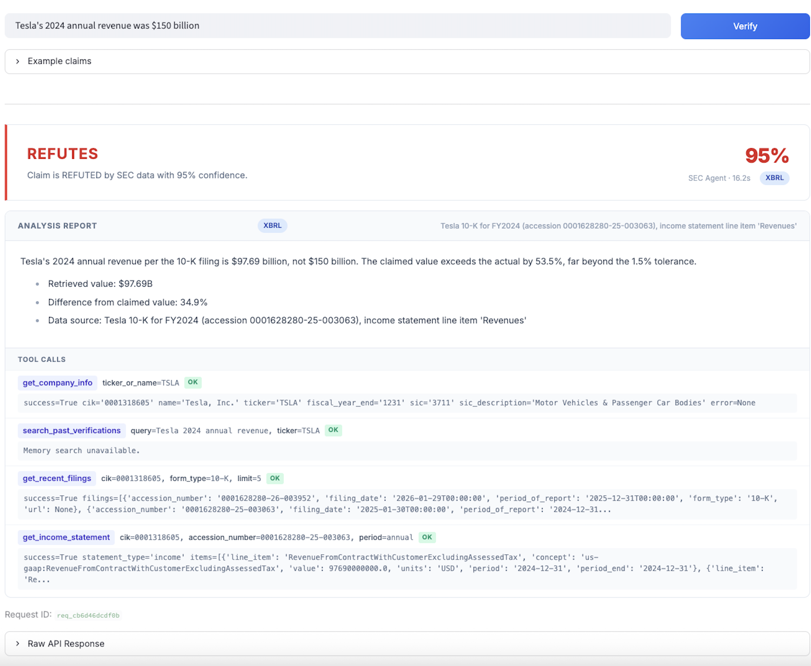
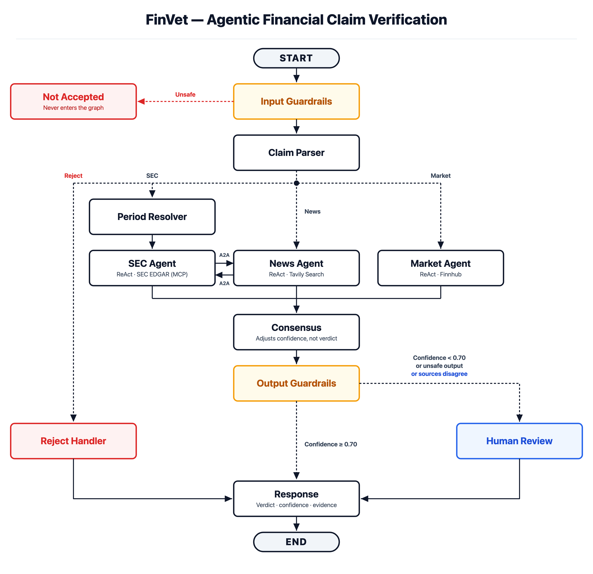

# FinVet

**Agentic financial claim verification.**

<!-- Restore after the first push, once CI has run once:
[](https://github.com/danielberhane/finvet/actions/workflows/ci.yml)
-->
[](LICENSE)


Give it a claim — *"Tesla's 2024 annual revenue was $150 billion"* — and it returns a verdict
(`SUPPORTS` / `REFUTES` / `NOT_ENOUGH_INFO`), a confidence score, the evidence chain, and an
audit trail of every step that produced the answer.

<p align="center">
  
</p>

> **Not financial advice.** A research and demonstration system; outputs may be wrong and must
> be independently verified. Not affiliated with any data provider named here.

---

## Deterministic verdict override

LLMs are unreliable at numeric comparison — a frontier model will confidently claim `0.98%`
exceeds `1%`. In claim verification, the task *is* comparing a claimed number to a filed one.
When both the claimed and retrieved values exist, FinVet recomputes the comparison in Python
with source-appropriate tolerances and overrides the model when they disagree. Both results
are recorded:

```python
{"verdict": "REFUTES", "llm_original_verdict": "SUPPORTS", "override_applied": True}
```

See [`_apply_override`](src/finvet/agents/base.py). This also limits prompt injection: injected
text can sway the model's prose, but not a numeric verdict.

---

## Architecture

A 12-node LangGraph `StateGraph`. Three domain agents route by claim type, each a ReAct loop
with its own tools. They are not isolated: an agent can delegate to another when the answer
lies outside its sources: the News agent asks SEC whether the issuer's own filing discloses a
reported fine or settlement, checking press coverage against the primary source.
Evidence is reconciled, guarded, and paused for human review on any of three triggers: low
confidence, unsafe output, or **two decisive sources disagreeing**. Filing silence is not a
fourth: deciding an issuer *should* have disclosed something is a materiality judgment, and
this release does not make one.

<p align="center">
  
</p>

| Agent | Handles | Sources | Can delegate to |
|---|---|---|---|
| **SEC** | GAAP financials — revenue, income, EPS, balance sheet, cash flow | SEC EDGAR (XBRL) via MCP; filing-text retrieval is in the toolbox but unused by Release A routing (see below) | — |
| **Market** | Prices, valuation, market cap | Finnhub | — |
| **News** | Events, announcements, macro indicators | Tavily search, FRED | SEC |

Delegation runs one way only, so it terminates by construction. Exactly one outcome escalates:
both sides reaching decisive but opposite verdicts. Silence does not — a periodic report omits
most things — and neither does silence from a filing that closed before the event. A filing
that was never successfully searched is recorded as such rather than counted as silence: a
claim about what a document says requires having read one.

Retrieved filing text is **supporting evidence**: it can show what a company said, and it
can never become the number a verdict rests on — the trust boundary rejects it as a numeric
observation regardless of shape, and every passage is tagged `evidence_role="supporting"`.
XBRL remains the authoritative numeric source for SEC claims.

Retrieval over filing text is hybrid: Postgres full-text relevance (`ts_rank` over a
`tsvector` column) plus pgvector cosine similarity, fused with reciprocal rank fusion.
Embeddings come from `nomic-embed-text` served locally, so no API key sits in the embedding
path. Both 10-K and 10-Q narrative text are indexed; sections are keyed by form part and item,
because a 10-Q restarts its numbering in each part and "Item 1" means different things in
Part I and Part II. Retrieval is scoped to the resolved period, and the dense arm has a relevance floor
calibrated against a labelled set rather than chosen — below it, the tool returns no evidence
instead of the nearest available passage.

**What Release A does not claim.** Retrieval is a tested subsystem, not a route a claim can
take. `METRIC_WHITELIST["sec"]` holds only numeric GAAP metrics, so a qualitative filing claim
("Apple discussed supplier concentration risk in its annual report") is rejected by the parser
as `non_financial` and never reaches an agent; the SEC prompt separately tells the model not to
call filing search to re-confirm an XBRL number. The result is that **no recorded execution has
produced filing-text evidence** — 0 of 322 in the audit trail. The retrieval measurements below
are of the subsystem, driven at the tool boundary. Wiring a qualitative claim type through to it
is Release B, and `scripts/release_gate_evidence.py` asserts the current state so it cannot
drift unnoticed.

Deeper dives: [`docs/ARCHITECTURE.md`](docs/ARCHITECTURE.md) ·
[`docs/RAG_AND_AGENTIC_RAG_GUIDE.md`](docs/RAG_AND_AGENTIC_RAG_GUIDE.md).

---

## Quickstart

The whole system — Postgres, Ollama, API, UI, and the SEC MCP server — comes up with one
command. The API creates its schema on first boot.

```bash
git clone https://github.com/danielberhane/finvet.git && cd finvet
cp .env.example .env            # add DEEPSEEK_API_KEY, TAVILY_API_KEY, POSTGRES_PASSWORD
docker compose --profile sec up --build
docker exec finvet-ollama ollama pull nomic-embed-text   # embeddings, one-time
# UI → http://localhost:8501   API → http://localhost:8000
```

Prebuilt images: `docker pull ghcr.io/danielberhane/finvet-api:latest` (and `finvet-ui`).

Every published port binds to `127.0.0.1`. The API has no authentication and Postgres ships a
development default password, so neither belongs on a shared network by accident. Containers
still reach each other normally — that traffic goes over the compose network, not a published
port. To expose the stack deliberately, set `FINVET_BIND_ADDR=0.0.0.0`, and change
`POSTGRES_PASSWORD` first.

The system verifies against live financial data, so real API keys are required. Only
`DEEPSEEK_API_KEY`, `TAVILY_API_KEY`, and `POSTGRES_PASSWORD` are mandatory; when an optional
key is absent, the corresponding feature is disabled rather than crashing.

<details>
<summary><b>Native dev · compose profiles · which key powers what</b></summary>

### Native (hot reload)

```bash
uv sync
cp .env.example .env
docker compose up -d postgres                        # pgvector
uvicorn finvet.main:app --port 8000 --app-dir src    # API → :8000
streamlit run ui/app.py --server.port 8501           # UI  → :8501
```

### Populating the RAG index

The vector store starts empty — SEC filings are not distributed with the repo. XBRL
verification works without it; hybrid RAG over filing text needs an ingest pass:

```bash
# Place filings as data/filings/<TICKER>/<TICKER>_<FORM>_<PERIOD-END>.html
#   e.g. data/filings/AAPL/AAPL_10-K_2024-09-28.html
python -m finvet.rag.ingest                    # defaults to data/filings
python -m finvet.rag.ingest --dir data/filings/AAPL
```

Requires a running Postgres and Ollama with `nomic-embed-text` pulled. **No API key** — the
embedding model is served locally, so ingest and search cost nothing per call.

### Profiles

| Profile | Adds | For |
|---|---|---|
| *(default)* | Postgres + pgvector, Ollama, API, UI | always |
| `--profile sec` | SEC EDGAR MCP (self-contained, from PyPI) | SEC claims (most demos) |

Ollama runs by default because it serves the embedding model that RAG and claim memory both
use. Pull `nomic-embed-text` once (~270 MB). The optional Llama Guard semantic guardrail uses
the same container but stays off unless you set `ENABLE_LLAMA_GUARD=true` and pull
`llama-guard3:8b` (~5 GB); the regex guard runs standalone either way.

### Keys

| Key | Powers | Without it |
|---|---|---|
| `DEEPSEEK_API_KEY` | claim parsing, agents, verdicts | **required** — nothing runs |
| `TAVILY_API_KEY` | news search | news claims → NOT_ENOUGH_INFO |
| `FINNHUB_API_KEY` | market quotes, tickers | market claims → NOT_ENOUGH_INFO |
| *(none)* | embeddings → RAG + claim memory | served locally by Ollama — no key, no per-call cost |
| *(none)* | FRED macro, SEC XBRL | free public endpoints |

The LLM is pluggable ([`llm/factory.py`](src/finvet/llm/factory.py)) — point any
endpoint speaking the OpenAI-compatible chat-completions protocol — Ollama, vLLM, LiteLLM, or
a hosted vendor — at it via env var, no code change. That protocol name is the wire format,
not a dependency on any provider.

</details>

---

## Features

- **Deterministic verdict override** — Python recomputes numeric comparisons; the LLM never
  has the final say on a number.
- **Model-directed ReAct agents in a deterministic workflow** — routing, period resolution,
  consensus and guardrails are fixed pipeline stages; within the selected agent the model
  chooses its own tools and iterations.
- **Hybrid retrieval over filings** *(subsystem; not reachable from claim routing in
  Release A)* — Postgres full-text relevance plus pgvector similarity,
  fused with RRF, scoped to the resolved period, with a calibrated relevance floor. Measured
  at the tool boundary
  on 30 positive and 30 negative queries over a 1,398-chunk corpus: zero irrelevant results
  accepted at full recall. Ten further near-miss queries — on topic but aimed at a period or
  form the corpus does not hold — return nothing, which the floor alone cannot achieve.
  Every case and its retrieval evidence is recorded in
  [`tests/accuracy/rag_release_a_manifest.json`](tests/accuracy/rag_release_a_manifest.json).
- **Bounded, in-process News-to-SEC delegation** — one hop, one direction. Not a network
  agent-to-agent protocol; the SEC agent holds no delegation tool, which is what makes the
  call terminate by construction.
- **Layered guardrails** — always-on regex/PII checks, plus an optional Llama Guard semantic
  layer, on both input and output. Safety is the guards' job; verifiability is the parser's.
- **Human-in-the-loop** — LangGraph `interrupt_before` pauses low-confidence or flagged
  verdicts for a reviewer, then resumes from the checkpoint with the decision merged in. A
  review is claimed atomically, so a second reviewer gets a conflict rather than overwriting
  the first. Checkpoints are held in memory: **pending reviews do not survive an API
  restart**, and an unresumable claim is refused rather than answered.
- **Audit trail with an integrity checksum** — every tool call, verdict decision, and data
  source persisted to Postgres, with a SHA-256 checksum over the stored execution envelope
  that the API re-verifies on read. It detects a record altered without its checksum being
  recomputed; it is not tamper-proof against a writer who can change both.
- **Bounded agent delegation** — the news agent can ask SEC whether the issuer's own filing
  discloses a reported fine or settlement. Only a decisive contradiction between the two
  sources sends the claim to a human; filing silence does not, and silence is only reported
  when an applicable filing was actually searched.
- **Claim memory** *(experimental, off by default)* — embedding search over past
  verifications. Its output is prior model output, not a source, so it ships disabled;
  `ENABLE_CLAIM_MEMORY=true` turns it on.

---

## Evaluation

Measured against SEC primary-source values, not self-reported. *Silently wrong* — a confident
number that disagrees with the filing — is treated as the failure that matters.

| Metric | Result |
|---|---|
| XBRL retrieval accuracy | **198/199 (99.5%)**, zero silently-wrong (the one miss returns NOT_ENOUGH_INFO) |
| Reject classification (refusing unverifiable claims) | **64.2% recall at 100% precision** — never rejects a verifiable claim |

Retrieval falls back from SEC's period-targeted `companyconcept` read to the `frames`
endpoint when the first is empty for a company/concept — that fallback took accuracy from
~91% to 99.5%.

---

## Security & operations

Packaged for **local / demo use, not public hosting as-is.**

- **Unauthenticated API** — no auth, rate limiting, or CORS. Run on a trusted network; put an
  authenticating proxy in front before any exposure.
- **Graceful degradation** — with SEC MCP or Ollama down, the API stays up and returns
  NOT_ENOUGH_INFO or routes to review rather than 500-ing. Losing the embedder costs the
  semantic half of RAG; keyword search keeps working.
- **Reproducible builds** — images build from a committed `uv.lock`, so CI, Docker, and dev
  resolve identical versions.
- **CI/CD** — [`ci.yml`](.github/workflows/ci.yml) runs lint + tests + Docker builds on every
  push; [`release.yml`](.github/workflows/release.yml) publishes versioned images to GHCR on
  a `v*` tag. There is intentionally no deploy-to-live stage.

*Production would add:* an auth gateway + rate limits, a secrets manager, managed/HA
Postgres, and an LLM cost budget.

---

## Limitations

- **US equities only** · **point-in-time claims** (no time series) · **latency 15–40s/claim**
  (one ReAct agent making real tool calls, plus an optional delegated run).
- **A numeric verdict requires a structured source.** Values are compared only when they come
  from an XBRL fact, a market quote field, or a FRED series. A number the model read out of
  prose is not evidence, so claims whose metric has no structured source — fines,
  settlements, analyst targets and 38 others the parser can emit — return NOT_ENOUGH_INFO
  rather than a verdict resting on an LLM's reading.
- **Q4 numeric derivation is unsupported.** Q4 is not filed separately, and deriving it needs
  a 12-month fact minus a nine-month one; retrieval is scoped to a single resolved period per
  request, so that pair cannot be requested. Such claims are declined explicitly rather than
  answered approximately.
- **Pending reviews do not survive an API restart.** Checkpoints are `MemorySaver`-backed; an
  unresumable review is refused rather than answered from the reviewer's own submission. A
  review whose graph ran but whose audit write failed is marked
  `REVIEW_FINALIZATION_FAILED` and can be retried via `POST /review/{id}/reconcile` — but that
  retry reads the in-memory checkpoint, so it is **same-process recovery only**, not
  cross-process or restart-durable.
- The consensus step is **heuristic**, not learned.
- **Historical prices need a paid Finnhub tier**; on a free key the market agent reports
  NOT_ENOUGH_INFO rather than scraping around it.
- **Not a compliance product** — it applies model-risk-management *principles*; it certifies
  nothing.
- **Python 3.11, 3.12 and 3.13** are tested in CI and are the supported range.

---

## Origins

FinVet evolved from [FinVet v1](https://github.com/danielberhane/finvet-acl-demo), which
combined two RAG pipelines and an external fact-check path through vote-based verdicts. This
version is a ground-up redesign as a multi-agent LangGraph system; what carried over is the
design thesis — evidence-backed verdicts with source attribution and explicit uncertainty.

## License & third-party

[Apache-2.0](LICENSE). Relies on external components it does not distribute — notably the
**AGPL-3.0** SEC EDGAR MCP server, run as its own container (installed from PyPI). See
[THIRD_PARTY_NOTICES.md](THIRD_PARTY_NOTICES.md). Users must honor each provider's terms,
including the [SEC Fair Access policy](https://www.sec.gov/os/webmaster-faq#developers)
(`SEC_EDGAR_USER_AGENT` needs a real name and email).
