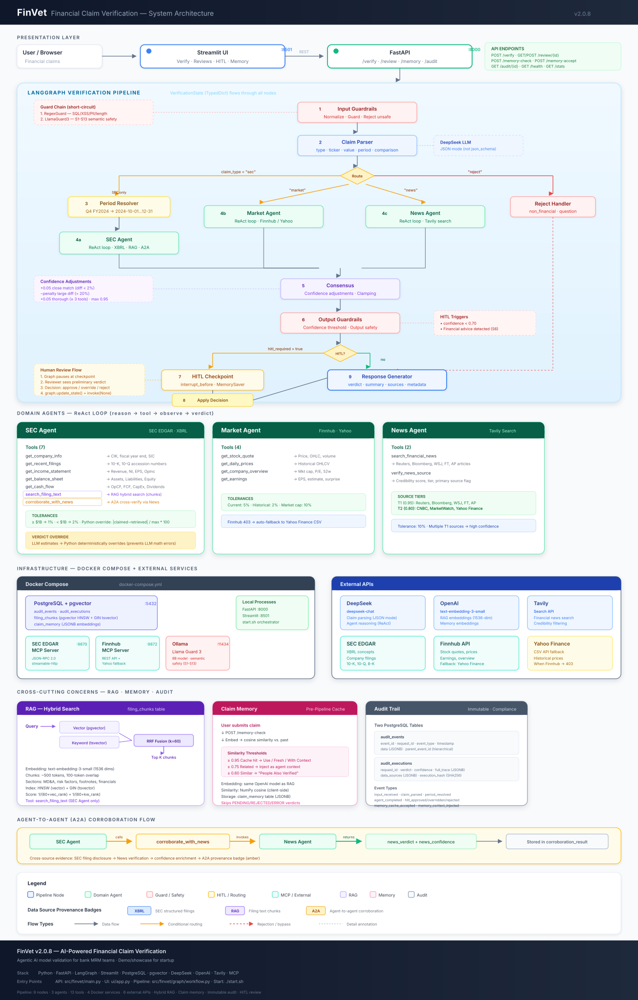

# FinVet

**An agentic AI system that verifies financial claims against authoritative sources — and records exactly how it decided.**

[](https://arxiv.org/abs/2510.11654)
[](https://github.com/GH_USER/finvet/actions/workflows/tests.yml)
[](LICENSE)


Give it a claim — *"Apple's Q4 2024 revenue was $94 billion"* — and it returns a verdict
(`SUPPORTS` / `REFUTES` / `NOT_ENOUGH_INFO`), a confidence score, the evidence chain, and a
complete audit trail of every step that produced the answer.

> [!IMPORTANT]
> **FinVet is a research and demonstration system for financial-claim verification.
> It is not investment, legal, accounting, or financial advice.** Outputs may be
> incomplete or incorrect and must be independently verified before any use. FinVet is
> not affiliated with, endorsed by, or certified by the SEC, Finnhub, Tavily, DeepSeek,
> OpenAI, or any other organisation named in this repository.

---

## The interesting part: the model doesn't get the last word

Verdict LLMs are unreliable at number comparison. The failure is mundane and consistent —
asked whether `0.98%` exceeds `1%`, a frontier model will confidently say yes.

In a domain where the whole task *is* comparing a claimed number to a filed number, that is
not an acceptable failure mode. So FinVet doesn't let the model decide anything deterministic.
When both the claimed value and the retrieved value are available, it recomputes the comparison
in Python — with source-appropriate tolerances — and overrides the model when they disagree.

Both outcomes are kept:

```python
{
    "verdict": "REFUTES",               # the deterministic result
    "llm_original_verdict": "SUPPORTS", # what the model said
    "override_applied": True,
    "magnitude_difference_percent": 12.4,
}
```

The override rate is not zero, which is the entire reason for measuring it.
See [`src/finvet/agents/base.py`](src/finvet/agents/base.py) → `_apply_override`.

---

## Architecture

Nine LangGraph nodes. Three domain agents fan out in parallel, each a ReAct loop with its own
tool set, and their verdicts are reconciled by a confidence-weighted consensus step.



```
input_guardrails → claim_parser → period_resolver
                                       │
                        ┌──────────────┼──────────────┐
                        ▼              ▼              ▼
                   SEC Agent     Market Agent    News Agent
                    (ReAct)        (ReAct)         (ReAct)
                        └──────────────┼──────────────┘
                                       ▼
              consensus → output_guardrails → hitl_checkpoint → response
```

| Agent | Handles | Sources |
|---|---|---|
| **SEC** | GAAP financials — revenue, net income, EPS, balance sheet, cash flow | SEC EDGAR via MCP, XBRL facts, hybrid RAG over filings |
| **Market** | Prices, valuation, market cap | Finnhub via MCP |
| **News** | Events, announcements, qualitative claims | Tavily search |

Full detail in [`docs/ARCHITECTURE.md`](docs/ARCHITECTURE.md).

---

## What's actually built

- **Hybrid RAG over SEC filings** — pgvector cosine similarity fused with Postgres `tsvector`
  BM25 via reciprocal rank fusion (k=60). Neither retriever alone was good enough on financial
  text: dense misses exact figures, sparse misses paraphrase.
- **Audit trail** — every node's input, output, duration, tool calls, and data provenance
  persisted to Postgres. You can open a verification from last month and reconstruct the
  decision path node by node.
- **Human-in-the-loop** — LangGraph `interrupt_before` on a checkpoint node. Low-confidence
  verdicts halt and wait for a reviewer; the run resumes from the checkpoint with the human's
  decision merged into state.
- **Layered guardrails** — a cheap regex/PII pass composed with an optional Llama Guard
  semantic layer, on both input and output. See [Guardrail modes](#guardrail-modes).
- **Agent-to-agent corroboration** — the SEC agent can call the news agent as a tool when
  filing data alone is ambiguous.
- **Claim memory** — embedding search over past verifications, so a repeated claim can be
  answered from cache or used as context rather than re-run.
- **Provenance tracking** — each number in the response carries where it came from (XBRL, RAG,
  or A2A), surfaced as badges in the UI.

---

## Running it

```bash
git clone https://github.com/GH_USER/finvet.git && cd finvet
uv sync                        # or: pip install -e ".[dev]"
cp .env.example .env           # fill in DEEPSEEK_API_KEY, TAVILY_API_KEY, POSTGRES_PASSWORD

docker compose up -d postgres  # pgvector; creates the extension on first start
python scripts/init_database.py

uvicorn finvet.main:app --port 8000 --app-dir src   # API  → :8000
streamlit run ui/app.py --server.port 8501          # UI   → :8501
```

**This is not a one-command demo.** It talks to real financial data sources, so it needs
Postgres with pgvector, an SEC EDGAR MCP server, and API keys. That's the honest cost of
not mocking the hard part.

### What runs with which keys

The system degrades by feature, not all at once. Each key gates exactly what
you'd expect, and nothing pretends to work without its key:

| Key | Powers | Without it |
|---|---|---|
| `DEEPSEEK_API_KEY` | claim parsing, agents, verdicts | nothing runs — this one is required |
| `TAVILY_API_KEY` | news-claim search | news claims return NOT_ENOUGH_INFO |
| `FINNHUB_API_KEY` | market quotes, ticker validation | market claims return NOT_ENOUGH_INFO |
| `OPENAI_API_KEY` | embeddings → **hybrid RAG** and **claim memory** | both are disabled: filing-text search returns an explicit error to the agent, memory lookups return empty, and startup logs say so. SEC claims still verify via XBRL |
| *(none)* | FRED macro data, SEC XBRL retrieval | free public endpoints — no key needed |

An `OPENAI_API_KEY` that exists but has no credits behaves like a missing key
for RAG and memory — check your billing if filing-text search comes back
empty.

### Services

`docker-compose.yml` uses profiles so you only start what you need:

| Command | Starts | When |
|---|---|---|
| `docker compose up -d postgres` | Postgres + pgvector | **Always.** Backs both the audit trail and the RAG vector store. |
| `docker compose --profile sec up -d` | SEC EDGAR MCP on :9870 | For SEC-agent claims. Needs [sec-edgar-mcp](https://github.com/stefanoamorelli/sec-edgar-mcp) cloned alongside this repo, or set `SEC_MCP_DIR`. |
| `docker compose --profile guards up -d` | Ollama on :11434 | Only for the semantic guardrail layer. |

### Guardrail modes

Input and output each pass through their own composite guard chain, which short-circuits on
the first failure and forwards scrubbed text to the next provider. The two chains hold
**different** providers:

| | Default chain | With `ENABLE_LLAMA_GUARD=true` | On violation |
|---|---|---|---|
| **Input** | `RegexGuard` | `RegexGuard` → `LlamaGuard` | raises `GuardrailViolation` — the claim is rejected |
| **Output** | `FinancialGuard` | `LlamaGuard` → `FinancialGuard` | routes to human review; never silently blocked |

- **Regex guard (input only).** Prompt-injection patterns plus SSN / credit-card / email /
  phone detection and redaction. No external dependency, sub-millisecond.
- **Financial guard (output only).** Flags responses that read as investment advice rather
  than claim verification.
- **Llama Guard 3 (optional, both chains).** Adds semantic classification with the S6
  "specialized advice" category customised for finance, so *"verify Apple's revenue"* passes
  while *"should I buy AAPL"* is flagged. Enable with:

  ```bash
  docker compose --profile guards up -d
  docker exec finvet-ollama ollama pull llama-guard3:8b   # ~5 GB
  # then set ENABLE_LLAMA_GUARD=true in .env
  ```

  The provider **fails open**: if Ollama is unreachable it returns safe with an
  `llama_guard_unavailable` flag rather than blocking the request. Safety hardens the system
  when it is up; it never takes the system down when it is not.

### Filing corpus

`data/filings/` is gitignored — the RAG corpus is re-fetchable SEC HTML, not something to
commit. Point the ingester at your own directory:

```bash
python -m finvet.rag.ingest --dir data/filings/AAPL
```

### Tests

```bash
pytest tests/unit -q         # 167 tests, ~1s, fully mocked — no keys or database needed
pytest tests/integration     # needs Postgres and the MCP server running
```

---

## Limitations

- **US equities only.** Ticker resolution and the SEC tooling assume US-listed companies.
- **Point-in-time claims.** Claims requiring a time series ("revenue grew every quarter since
  2020") are outside the current claim schema.
- **The consensus step is heuristic**, not learned — confidence adjustments are hand-tuned
  constants in [`src/finvet/config/constants.py`](src/finvet/config/constants.py), fitted on a
  small claim suite rather than a benchmark.
- **Historical prices need a paid Finnhub tier.** `get_daily_prices` is gated behind
  Finnhub's paid plan; on a free key it returns 403 and the market agent reports
  NOT_ENOUGH_INFO. FinVet does not scrape any provider to work around this — current
  quotes, market cap and earnings are unaffected.
- **Latency is 15–40s per claim.** Three ReAct agents making real tool calls; this is not a
  low-latency path.
- **Not a compliance product.** It applies model-risk-management *principles* to an LLM system.
  It does not certify anything against any regulation.

---

## Paper

The system was first described in:

> **FinVet: A Collaborative Framework of RAG and External Fact-Checking Agents for Financial
> Misinformation Detection** — Daniel Berhane Araya, Duoduo Liao.
> [arXiv:2510.11654](https://arxiv.org/abs/2510.11654) (2025)

**This repository is the production evolution of that system, not its replication code.** The
paper reports F1 0.85 on the FinFact dataset for the earlier architecture; that benchmark is
not reproduced here. What carried over is the design thesis — evidence-backed verdicts with
source attribution, confidence scores, and explicit uncertainty rather than a bare label.

## Third-party dependencies

FinVet's own source is Apache-2.0. It relies on external components it does not include or
distribute — most notably the SEC EDGAR MCP server, which is **AGPL-3.0** and is run as a
separate process you clone and start yourself. See
[THIRD_PARTY_NOTICES.md](THIRD_PARTY_NOTICES.md).

Users are responsible for complying with the terms of every external service they configure,
including the [SEC's automated-access / Fair Access policy](https://www.sec.gov/os/webmaster-faq#developers),
which requires a real name and contact address in `SEC_EDGAR_USER_AGENT`.

## License

[Apache-2.0](LICENSE)
