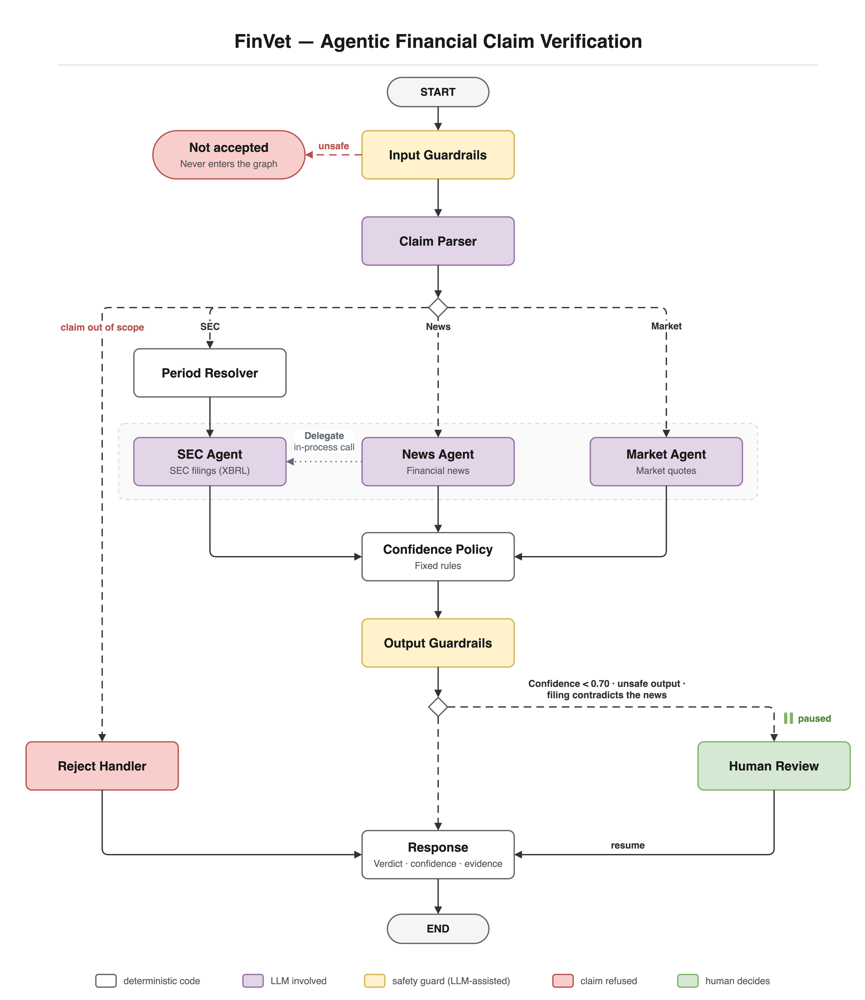
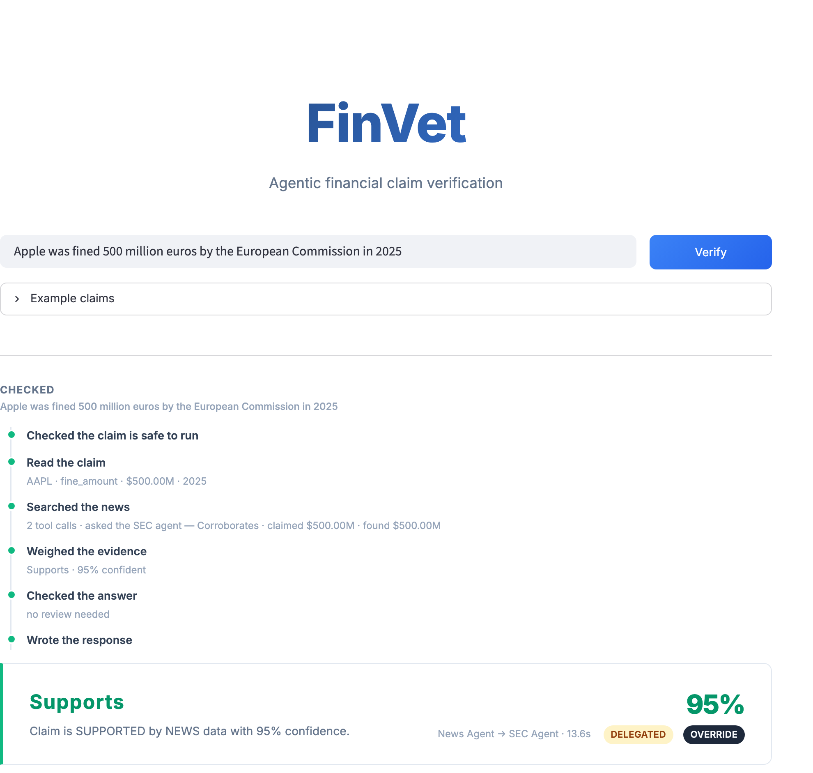

# FinVet

**Agentic financial claim verification.**

[](https://github.com/danielberhane/finvet/actions/workflows/ci.yml)
[](LICENSE)


FinVet verifies one financial claim at a time. Given *"Microsoft's fiscal 2025 revenue was
$282 billion,"* it returns a verdict of supported, refuted, or not enough information, a
confidence score, and the number it compared the claim against. Each response also names the
agent that answered, lists every tool call it made in order, and keeps an audit trail of the
run.

<p align="center">
  <a href="docs/diagrams/finvet-linkedin.png"></a>
</p>

> **Not financial advice.** A research and demonstration system; outputs may be wrong and must
> be independently verified. Not affiliated with any data provider named here.

---

## Deterministic verdict override

The AI finds the number. Python compares it to the claim, because AI models make mistakes with
numbers. If they disagree, Python's answer wins, and the response shows both. If no source
returns a number, FinVet says "not enough information" instead of guessing.

---

## Evaluation

349 held-out financial claims across 76 US-listed companies, from mega-caps to mid-caps,
including banks and insurers, non-calendar fiscal years and restated periods. Two models on
identical code, four runs each.

| Layer | DeepSeek-V4.1-Flash | Qwen3.8 |
|---|---|---|
| 1. Outcome — verdict accuracy | **97.0%** | **96.7%** |
| 2. Tool trajectory — tools called | 99.2% | 97.7% |
| 3. Grounding — numbers traced | **100%** | **100%** |
| 4. Calibration — decisive ECE | 0.049 | 0.050 |
| 5. Asymmetric risk, confidently-wrong | 1 | **0** |
| 5. Asymmetric risk, declined | 2.7% | 3.6% |
| 6. Reliability — pass^4 | **94.8%** | **91.5%** |
| 7. Reachability — expected path | 94.8% | 97.9% |

First run of each model; pass^4 uses all four. Accuracy excludes the 28 live-price claims. The
one wrong verdict in eight runs was a net loss parsed as a gain; every other miss was a decline
or an escalation. Dataset, method, per-run results and the artifacts every figure recomputes
from: [`docs/eval/`](docs/eval/).

---

## Architecture

One agent runs per claim, chosen by claim type.

| Agent | Handles | Sources |
|---|---|---|
| **SEC** | GAAP financials, filing text | SEC EDGAR XBRL via MCP, hybrid RAG over filings |
| **Market** | Prices, valuation, market cap | Finnhub |
| **News** | Events, fines, settlements | Tavily search, and one-way delegation to SEC (cannot recurse) |

<p align="center">
  <a href="docs/diagrams/finvet-delegation-run.png"></a>
  <br><sub>A news claim settled by delegation: the SEC agent found the same &euro;500 million in Apple's filing.</sub>
</p>

**Review and audit.** Regex and PII guards always run, with optional Llama Guard. Low
confidence, unsafe output or a press-versus-filing conflict pauses the graph at a checkpoint
until a reviewer decides. Every tool call and verdict is persisted with a checksum the API
re-verifies on read ([SECURITY.md](SECURITY.md)).

Mechanics — retrieval fusion, delegation states, review recovery:
[`docs/ARCHITECTURE.md`](docs/ARCHITECTURE.md).

---

## Quickstart

```bash
git clone https://github.com/danielberhane/finvet.git && cd finvet
cp .env.example .env            # add DEEPSEEK_API_KEY, TAVILY_API_KEY, POSTGRES_PASSWORD
docker compose --profile sec up --build
docker exec finvet-ollama ollama pull nomic-embed-text   # embeddings, one-time
# UI → http://localhost:8501   API → http://localhost:8000
```

Prebuilt images are published on tagged releases: `docker pull ghcr.io/danielberhane/finvet-api:latest`
(and `finvet-ui`). Every port binds to `127.0.0.1`; read [SECURITY.md](SECURITY.md) before
exposing the stack. Real API keys are required, since the system verifies against live data.
Missing optional keys disable their feature rather than crashing. `--profile sec` adds the
SEC EDGAR MCP container, needed for SEC claims.

<details>
<summary><b>Native dev · RAG ingest · keys</b></summary>

### Native (hot reload)

```bash
uv sync
cp .env.example .env
docker compose up -d postgres                        # pgvector
uvicorn finvet.main:app --port 8000 --app-dir src    # API → :8000
streamlit run ui/app.py --server.port 8501           # UI  → :8501
```

### Populating the RAG index

The vector store starts empty — filings are not distributed with the repo. XBRL verification
works without it; RAG over filing text needs an ingest pass:

```bash
# Place filings as data/filings/<TICKER>/<TICKER>_<FORM>_<PERIOD-END>.html
python -m finvet.rag.ingest                    # defaults to data/filings
```

Requires Postgres and Ollama with `nomic-embed-text` pulled (~270 MB, no API key — embedding
is local).

### Keys

| Key | Powers | Without it |
|---|---|---|
| `DEEPSEEK_API_KEY` | claim parsing, agents, verdicts | startup fails unless the roles point at another endpoint |
| `TAVILY_API_KEY` | news search | **required** — nothing runs |
| `FINNHUB_API_KEY` | market quotes, tickers | market claims → NOT_ENOUGH_INFO |
| *(none)* | embeddings, SEC XBRL | local Ollama / free public endpoints |
| `ENABLE_LLAMA_GUARD=true` | Llama Guard on input and output (`llama-guard3:8b`, ~5 GB) | regex and PII guards only |

The LLM is pluggable ([`llm/factory.py`](src/finvet/llm/factory.py)): point any
OpenAI-compatible chat-completions endpoint — Ollama, vLLM, LiteLLM, or a hosted vendor — at
any of the three roles via env vars, no code change.

LangSmith tracing is off by default; enabling it sends claim text, tool outputs and prompts to
LangSmith. Setup in [`docs/ARCHITECTURE.md`](docs/ARCHITECTURE.md#7-configuration-reference).

</details>

---

## Limitations

**Scope.** One English sentence stating one fact about a US-listed company. Compound claims
are not decomposed; value ranges, relative changes ("doubled since 2020") and fourth-quarter
derivations decline rather than guess.

**Sources.** A numeric verdict needs a structured source: an XBRL fact, a market quote, or the
deterministic fine and settlement extraction. The other 45 metrics the parser accepts, analyst
price targets among them, decline up front with a stated reason. Market data is the current
delayed quote only; historical prices and figures with no observation time fail closed.

**Audit trail.** The number, concept, period and filing behind a verdict are stored; the
model's reasoning text is returned, not stored.

**Deployment.** A single-process research system: no authentication, rate limiting or tenant
isolation ([SECURITY.md](SECURITY.md)), and pending reviews live in memory, so they do not survive
a restart. Not load- or failover-tested. With SEC MCP or Ollama down it declines or escalates
rather than failing. Latency on DeepSeek, one claim at a time: p50 11 s, p95 76 s, the tail
being claims that read filing prose.

**Not a compliance product.** It applies model-risk principles and certifies nothing.

---

## Contributing

Bug reports and focused fixes are welcome. [CONTRIBUTING.md](CONTRIBUTING.md) covers setup,
what CI enforces, and the changes that will be declined. For vulnerability reports, and for
what this system does and does not defend against, see [SECURITY.md](SECURITY.md).

## Citation

To cite this software, use [CITATION.cff](CITATION.cff).

**Prior work.** FinVet v1 ([IEEE BigData 2025](https://ieeexplore.ieee.org/document/11400848),
with Duoduo Liao; [code](https://github.com/danielberhane/finvet-v1)) decided verdicts by
confidence-weighted vote over two retrieval pipelines. This release replaces that with one agent
per claim and a deterministic comparator.

## License

[Apache-2.0](LICENSE). FinVet runs third-party components without distributing them, notably
the AGPL-3.0 SEC EDGAR MCP server, which runs as its own container; see
[THIRD_PARTY_NOTICES.md](THIRD_PARTY_NOTICES.md). Users must honor each provider's terms,
including the [SEC Fair Access policy](https://www.sec.gov/os/webmaster-faq#developers).
