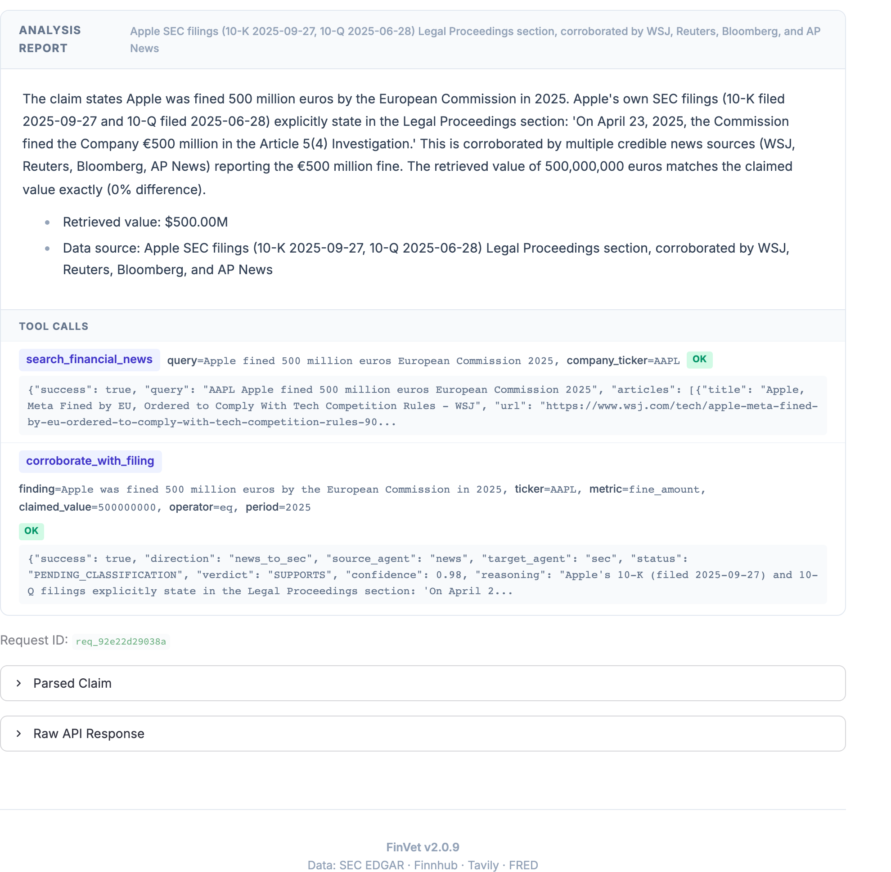

# FinVet

**Agentic financial claim verification.**

[](https://github.com/danielberhane/finvet/actions/workflows/ci.yml)
[](LICENSE)


FinVet verifies one financial claim at a time. Given *"Microsoft's fiscal 2025 revenue was
$282 billion,"* it returns a verdict of supported, refuted, or not enough information, a
confidence score, and the number it compared the claim against. Each response also names the
agent that answered, lists every tool call it made in order, and keeps an audit trail of the
run.

<p align="center">
  <a href="docs/diagrams/finvet-linkedin.png"></a>
  <br><sub>Click the diagram for full resolution.</sub>
</p>

> **Not financial advice.** A research and demonstration system; outputs may be wrong and must
> be independently verified. Not affiliated with any data provider named here.

---

## Deterministic verdict override

Models are unreliable at comparing numbers, and that comparison decides the verdict. FinVet
recomputes it in Python, with tolerances that depend on the source. Python's result stands
when the two disagree, and both verdicts are kept in the response.

The comparison uses only a structured value returned by a tool. A claim with no such value
returns not enough information.

---

## Evaluation

**Claim set.** 349 financial claims (`golden_u.jsonl`), held out and frozen: 97 written claims
over five mega-caps, and 252 claims over 65 further filers in five named hardness classes
(non-calendar fiscal years, banks and insurers, mid-caps, filers whose primary revenue concept
is not the usual one, and restated years), with a natural-phrasing arm. 76 tickers, none shared
between the two parts. The numeric labels of the second part are derived from SEC `companyfacts`
data by script, with no person choosing the number, and its pass/fail criteria are pre-registered
— committed before any run. The dataset is hashed and frozen before the reported run. Six rows
whose text is published in the cards are excluded from every run, so 343 are scored, 329 of them
with an expected verdict. Composition, labelling rules and disclosed biases are in the
[dataset card](docs/eval/DATASET_CARD.md), the [golden_g card](docs/eval/GOLDEN_G_CARD.md) and
the [golden_u card](docs/eval/GOLDEN_U_CARD.md).

**Protocol.** Two models on identical code, each run four times on 2026-09-29 to measure
stability. Retrieval is measured separately, on its own cases. Each run is scored on seven
layers:

1. **Outcome**: the verdict.
2. **Tool trajectory**: the tools called.
3. **Grounding**: every decisive number traced to a source.
4. **Calibration**: stated confidence against observed accuracy.
5. **Asymmetric risk**: the cost of the errors made.
6. **Reliability**: agreement across repeated runs.
7. **Reachability**: evidence arriving by the expected path.

### Cross-model benchmark

| Layer | DeepSeek-V4.1-Flash | Qwen3.8 |
|---|---|---|
| 1. Outcome — verdict accuracy | **97.0%** | **96.7%** |
| 2. Tool trajectory — tools called | 99.2% | 97.7% |
| 3. Grounding — numbers traced | **100%** | **100%** |
| 4. Calibration — decisive ECE | 0.049 | 0.050 |
| 5. Asymmetric risk, confidently-wrong | 1 | **0** |
| 5. Asymmetric risk, declined | 2.7% | 3.6% |
| 6. Reliability — pass^4 | **94.8%** | **91.5%** |
| 7. Reachability — expected path | 94.8% | 97.9% |

Rows 1 to 5 and 7 are the first run of each model; row 6 uses all four. Outcome is scored on
301 claims: the 329 with an expected verdict, excluding the 28 whose answer depends on a live
share price. Trajectory uses DeepEval's `ToolCorrectnessMetric` over the claims whose strategy
requires a tool (265 for DeepSeek, 266 for Qwen). Grounding covers every decisive number the run
produced (242 and 239). Asymmetric risk is over the 329 claims with an expected verdict.
Reliability is pass^4 over four runs on the same 329.

Three rows are enforced by the code rather than measured by the run: an agent cannot call
another agent's tools, the 59 claims that must spend nothing never reach one, and a decisive
numeric verdict is unreachable without a trusted observation.

**Stability.** Four runs per model. DeepSeek-V4.1-Flash: pass@1 97.0%, **pass^4 94.8%**. Of the
17 rows that missed pass^4, 16 had escalated to human review on at least one attempt; one
returned a wrong verdict — a claim stating a net loss, which the parser read as a gain in two
of the four runs and the comparison then refuted. Qwen3.8: pass@1 96.4%, **pass^4 91.5%**;
every one of its 28 misses escalated, declined or timed out, and none returned a wrong verdict.

**Models.** DeepSeek-V4.1-Flash is served by DeepSeek's API under the id `deepseek-flash`
(1M-token context). Qwen3.8 is served on vLLM by a university research cluster through a
LiteLLM gateway (262K-token context); every request was opted out of the gateway's response
cache, so the four runs are independent — 0 of 7,404 replies came from the cache. Neither
service publishes the model's parameter count.

**Retrieval.** XBRL lookups against SEC primary-source values: **198/199**, the one miss
returning not enough information rather than a wrong number. Filing-text retrieval is
measured on a separate 70-case set. Both gold sets are held privately, so unlike the table
above these two figures are not recomputable from this repository.

**Evidence.** [`docs/eval/`](docs/eval/) holds the redacted per-claim artifacts of all eight
runs, the layer summaries, the [benchmark write-up](docs/eval/BENCHMARK_2026-09-29.md) and the
dataset cards. Every figure in the table recomputes from them. The claim set itself is held
out, and available to reviewers against its published hash. Its first 97 claims were written by
the author of the system; 57 of their parse labels have not been adjudicated by a second reader,
and no independent validation has been performed. The earlier benchmark on those 97 claims
alone, with `deepseek-chat` and `MiniMax-M2.7`, remains in the same folder with its
[write-up](docs/eval/BENCHMARK_2026-08-31.md).

---

## Architecture

A 12-node LangGraph `StateGraph`. Three domain agents route by claim type, each a ReAct loop
with its own tools; routing, period resolution, confidence policy and guardrails are fixed
pipeline stages, and within the selected agent the model chooses its own tool calls. One
agent runs per claim.

| Agent | Handles | Sources | Can delegate to |
|---|---|---|---|
| **SEC** | GAAP financials, and claims about what a filing says | SEC EDGAR (XBRL) via MCP, hybrid RAG over filing text | — |
| **Market** | Prices, valuation, market cap | Finnhub | — |
| **News** | Events and announcements | Tavily search | SEC |

**Delegation** runs one way: News asks SEC whether the issuer's own filing discloses a
reported fine or settlement. One hop, in-process, no wire protocol. The SEC agent holds no
delegation tool, so the call cannot recurse. Where the filing states an amount, the verdict follows the filing rather than the
press.

<p align="center">
  <a href="docs/diagrams/finvet-delegation-run.png"></a>
  <br><sub>A news claim the news agent could not settle alone: it searched, then handed the finding
  to the SEC agent, which found the same &euro;500 million in Apple's filing.</sub>
</p>

<p align="center">
  <a href="docs/diagrams/finvet-delegation-evidence.png"></a>
  <br><sub>The same run's evidence: every tool call with its arguments and raw response, including the
  delegation itself and what the SEC agent sent back. Click either image for full resolution.</sub>
</p>

**Trust boundary.** XBRL is the authoritative numeric source. Retrieved filing text is
supporting evidence, and a model's reading of it never becomes the number a verdict rests on;
absence of a passage is never treated as refutation. The one exception is fines and
settlements, which have no XBRL concept: Python extracts the amount from Legal Proceedings
text, and only when exactly one unambiguous candidate is present.

**Guardrails and review.** Regex and PII checks always run, with an optional Llama Guard layer
on input and output. The guards decide safety; the parser decides whether a claim is
verifiable. Review triggers on low confidence, unsafe output, or a press-versus-filing
conflict, pausing at a LangGraph checkpoint and resuming with the reviewer's decision merged
in. Every tool call and verdict is persisted with a checksum the API re-verifies on read; see
[SECURITY.md](SECURITY.md) for what that does and does not guarantee.

Mechanics — retrieval fusion, delegation states, review recovery:
[`docs/ARCHITECTURE.md`](docs/ARCHITECTURE.md).

---

## Quickstart

```bash
git clone https://github.com/danielberhane/finvet.git && cd finvet
cp .env.example .env            # add DEEPSEEK_API_KEY, TAVILY_API_KEY, POSTGRES_PASSWORD
docker compose --profile sec up --build
docker exec finvet-ollama ollama pull nomic-embed-text   # embeddings, one-time
# UI → http://localhost:8501   API → http://localhost:8000
```

Prebuilt images are published on tagged releases: `docker pull ghcr.io/danielberhane/finvet-api:latest`
(and `finvet-ui`). Every port binds to `127.0.0.1`; read [SECURITY.md](SECURITY.md) before
exposing the stack. Real API keys are required, since the system verifies against live data.
Missing optional keys disable their feature rather than crashing.

<details>
<summary><b>Native dev · RAG ingest · compose profiles · which key powers what</b></summary>

### Native (hot reload)

```bash
uv sync
cp .env.example .env
docker compose up -d postgres                        # pgvector
uvicorn finvet.main:app --port 8000 --app-dir src    # API → :8000
streamlit run ui/app.py --server.port 8501           # UI  → :8501
```

### Populating the RAG index

The vector store starts empty — filings are not distributed with the repo. XBRL verification
works without it; RAG over filing text needs an ingest pass:

```bash
# Place filings as data/filings/<TICKER>/<TICKER>_<FORM>_<PERIOD-END>.html
python -m finvet.rag.ingest                    # defaults to data/filings
```

Requires Postgres and Ollama with `nomic-embed-text` pulled (~270 MB, no API key — embedding
is local). The optional Llama Guard layer needs `ENABLE_LLAMA_GUARD=true` and
`llama-guard3:8b` (~5 GB).

### Profiles

| Profile | Adds | For |
|---|---|---|
| *(default)* | Postgres + pgvector, Ollama, API, UI | always |
| `--profile sec` | SEC EDGAR MCP (self-contained, from PyPI) | SEC claims (most demos) |

### Keys

| Key | Powers | Without it |
|---|---|---|
| `DEEPSEEK_API_KEY` | claim parsing, agents, verdicts | the default provider fails to start; point the roles elsewhere and it is not needed |
| `TAVILY_API_KEY` | news search | **required** — nothing runs |
| `FINNHUB_API_KEY` | market quotes, tickers | market claims → NOT_ENOUGH_INFO |
| *(none)* | embeddings, SEC XBRL | local Ollama / free public endpoints |

The LLM is pluggable ([`llm/factory.py`](src/finvet/llm/factory.py)): point any
OpenAI-compatible chat-completions endpoint — Ollama, vLLM, LiteLLM, or a hosted vendor — at
any of the three roles via env vars, no code change.

### Tracing (LangSmith)

Off by default. Set `LANGCHAIN_TRACING_V2=true`, `LANGCHAIN_API_KEY`, and `LANGCHAIN_PROJECT`
in `.env` and restart the API. Every verification then appears as one trace carrying its
`request_id`, so it joins to its audit row at `GET /audit/{request_id}`. Trace names, what a
trace contains, and sample timings:
[`docs/ARCHITECTURE.md`](docs/ARCHITECTURE.md#7-configuration-reference).

**Tracing is data egress.** The claim text, tool outputs (filing excerpts, quotes, news
snippets), and model prompts leave the machine for LangSmith. Do not enable it on claims you
would not send to a third party.

</details>

---

## Limitations

Packaged for local and demo use. With SEC MCP or Ollama down, the API degrades to
NOT_ENOUGH_INFO or review rather than failing.

- **Scope**: US large-cap equities, one claim at a time — a single English sentence stating one
  fact. Compound claims are not decomposed; fourth-quarter figures and unservable metrics are
  declined with a stated reason; value ranges fail closed to human review; relative changes
  ("doubled since 2020") parse to no value and are declined. Latency on the default provider,
  p50 11s and p95 76s per claim; the slow tail is the fines and restated-year claims, which
  read filing prose.
- **Numeric verdicts need a structured source**: an XBRL fact, a market quote field, or the
  deterministic fine/settlement extraction. The other 45 metrics the parser accepts, analyst
  price targets among them, are declined up front with a stated reason.
- **Market data is current-price only.** Finnhub's free tier provides a quote delayed 15–20
  minutes and no price history, so only current-price claims with no stated period reach a
  verdict; historical price claims, and figures like market cap and P/E with no observation
  time, fail closed.
- **A stated loss can be read as a gain.** The parser turns "a net loss of $3.63 billion" into a
  positive value in some runs, and the comparison then refutes a true claim against the filed
  negative figure. This is the one wrong verdict the benchmark produced (row 1073, in two of
  four DeepSeek runs) and the parser's sign handling is the next fix.
- **Model reasoning is not stored.** The verdict's basis — the number, its concept, period and
  filing, and what it replaced — is recorded in the artifact and the audit trail; the prose the
  model wrote about it is returned in the response and not persisted.
- **Not a compliance product.** It applies model-risk-management principles; it certifies
  nothing.
- **Not a service.** The API has no authentication, authorization, rate limiting or tenant
  isolation ([SECURITY.md](SECURITY.md)). Review checkpoints live in process memory, so a
  pending review does not survive an API restart. It is single-process and has not been
  load-, failover- or sustained-degradation-tested; the latency figures above are from
  benchmark runs, one claim at a time.

Next: decomposition of multi-assertion claims, a paid market-data tier with historical price
alignment, and Q4 derivation.

---

## Contributing

Bug reports and focused fixes are welcome. [CONTRIBUTING.md](CONTRIBUTING.md) covers setup,
what CI enforces, and the changes that will be declined. For vulnerability reports, and for
what this system does and does not defend against, see [SECURITY.md](SECURITY.md).

## Citation

To cite this software, use [CITATION.cff](CITATION.cff).

**Prior work.** FinVet v1, joint work with Duoduo Liao, verified claims with two retrieval
pipelines and an external fact-check source, deciding verdicts by confidence-weighted vote
([IEEE BigData 2025](https://ieeexplore.ieee.org/document/11400848);
[code](https://github.com/danielberhane/finvet-v1)). This release replaces that design: one
agent per claim, and the verdict settled by a deterministic comparator rather than a vote.

## License

[Apache-2.0](LICENSE). FinVet runs third-party components without distributing them, notably
the AGPL-3.0 SEC EDGAR MCP server, which runs as its own container; see
[THIRD_PARTY_NOTICES.md](THIRD_PARTY_NOTICES.md). Users must honor each provider's terms,
including the [SEC Fair Access policy](https://www.sec.gov/os/webmaster-faq#developers).
